<div align="center">

 
</div>
---
 
<div align="center">

 
<br>
[](https://tryhackme.com/p/priyanshshigawan)
[](https://app.hackthebox.com/profile/)
[](https://linkedin.com/in/priyanshshigawan)
[](https://github.com/priyanshshigawan-star)
[](https://github.com/priyanshshigawan-star)
 
</div>
---
 
## `> whoami`
 
```bash
  NAME      ::  Priyansh Shigawan
  LOCATION  ::  India 🇮🇳
  ROLE      ::  Cybersecurity Enthusiast & Ethical Hacker
  FOCUS     ::  Penetration Testing | Network Security | CTF
  STATUS    ::  [ACTIVE] — always learning, always hacking (ethically)
  MISSION   ::  Making the internet safer, one exploit at a time
```
 
---
 
## `> ls -la skills/`
 
### 🔴 Offensive Security


 
### 🔵 Defensive & Monitoring


 
### 💻 Programming & Scripting


 
---
 
## `> cat certs.txt`
 
```
[✓] Google Cybersecurity Certificate  .... COMPLETED
[~] CompTIA Security+  .................. IN PROGRESS
[~] TryHackMe Jr Pen Tester  ............ IN PROGRESS
[>] CEH — Certified Ethical Hacker  ..... TARGET 2025
[>] OSCP  ............................... TARGET 2026
```
 
---
 
## `> top` (GitHub Stats)
 
<div align="center">

 

 

 
</div>
---
 
## `> traceroute contact`
 
<div align="center">
| Channel | Link |
|---------|------|
| 📧 Email | priyanshshigawan@email.com |
| 💼 LinkedIn | [linkedin.com/in/priyanshshigawan](https://linkedin.com/in/priyanshshigawan) |
| 🎯 TryHackMe | [tryhackme.com/p/priyanshshigawan](https://tryhackme.com/p/priyanshshigawan) |
| 💀 HackTheBox | [app.hackthebox.com/profile](https://app.hackthebox.com/profile/) |
 
</div>
---
 
<div align="center">
```
root@mainframe:~# echo "Thanks for visiting!"
[+] Star my repos if you find them useful.
[+] Open to connect, collaborate, hack together.
[+] Happy hacking — ethically, always. 🛡️
root@mainframe:~# █
```
 
</div>
 

